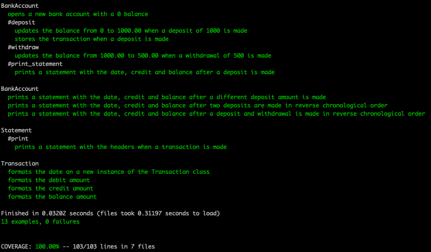

# Bank tech test

I completed this tech test to practice my OO design and TDD skills. Original specifications can be found [here](https://github.com/makersacademy/course/blob/master/individual_challenges/bank_tech_test.md)

## Specification

### Requirements

* You should be able to interact with your code via a REPL like IRB or the JavaScript console.  (You don't need to implement a command line interface that takes input from STDIN.)
* Deposits, withdrawal.
* Account statement (date, amount, balance) printing.
* Data can be kept in memory (it doesn't need to be stored to a database or anything).

### Acceptance criteria

**Given** a client makes a deposit of 1000 on 10-01-2012  
**And** a deposit of 2000 on 13-01-2012  
**And** a withdrawal of 500 on 14-01-2012  
**When** she prints her bank statement  
**Then** she would see

```
date || credit || debit || balance
14/01/2012 || || 500.00 || 2500.00
13/01/2012 || 2000.00 || || 3000.00
10/01/2012 || 1000.00 || || 1000.00
```

## The Plan

The first step in my planing process was to break the requirements and acceptance criteria into user stories and think about how I would expect the user to interact with the code.

```
As a client,
So that I can save my money,
I want to open a bank account.

As a client,
So that I can add money to my account,
I want to be able to make a deposit.

As a client,
So that I can keep track of my money,
I want to be able to view my balance.

As a client,
So that I can spend my money,
I want to be able to make a withdrawal.

As a client,
So that I know when i made a transaction,
I want to see the date the transaction was made,

As a client,
So that I can see a history of my transactions,
I want to be able to print a statement.

As a client,
So that I can easily follow the history of my transactions,
I want to view my statement in reverse chronological order.

```

For User Story 2 & 3, I felt it would be useful to create an Input/Output table to guide the development of my tests and my code.

|Input|Output  |
|--|--|
| account.print_statement| date II credit II debit II balance |
| account.deposit(1000) |  |
| account.print_statement| date II credit II debit II balance |
||11/01/2012 II 1000.00 II II 1000.00 |
| account.deposit(2000) |  |
| account.print_statement| date II credit II debit II balance |
||11/01/2012 II 2000.00 II II 3000.00 |
||11/01/2012 II 1000.00 II II 1000.00 |
| account.withdraw(500) |  |
| account.print_statement| date II credit II debit II balance |
||12/01/2012 II II 500.00 II 2500 |
||11/01/2012 II 2000.00 II II 3000.00 |
||11/01/2012 II 1000.00 II II 1000.00 |

After receiving [feedback](feedback.png) I simplified some code by storing the transactions as a list of Transaction instances directly (so not calling `create` after Transaction.new ) in the `deposit` and `withdraw` methods. I also decoupled the classes using mocking to isolate the unit tests so the BankAccount unit tests don't directly rely on the actual implementation of the Transaction class or Statement.

Once I had isolated the unit tests, I added a separate rspec feature test (no mocks) which asserts that the program is functioning as expected.

I used Rubocop to fix code that did not conform to the Ruby style guide and SimpleCov to check my test coverage.




## To Run

1. Clone this repository
2. Run bundle install to install required gems
3. Run rspec to view tests.
3. Open IRB, require the file and interact with the program as below:

```
2.7.0 :001 > require './lib/bank_account.rb'
 => true
2.7.0 :002 > account = BankAccount.new
2.7.0 :003 > account.deposit(1000)
2.7.0 :004 > account.deposit(2000)
2.7.0 :005 > account.withdraw(500)
2.7.0 :006 > account.print_statement
date || credit || debit || balance
13/01/2021 || 0.00 || 500.00 || 2500.00
13/01/2021 || 2000.00 || 0.00 || 3000.00
13/01/2021 || 1000.00 || 0.00 || 1000.00
```
